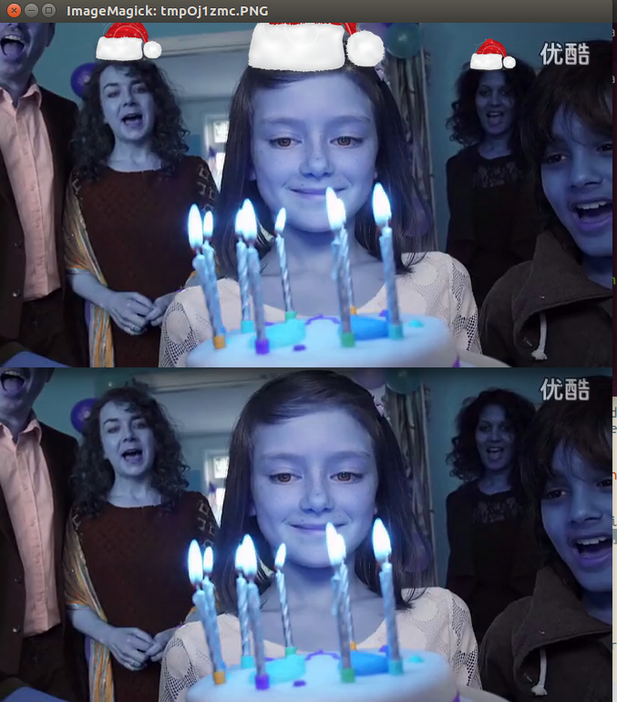

# Auto Add Santa Hat Machine

## Introduction

&emsp;It is a face recognition program which can add Santa Hat to a image or video, that can be recognized as human faces. The program find the locations of all faces in the image (or every frame in video) first, and use the resized transparent santa-hat.png to paste over the image.

## Ready

- A picture or an video with human faces.


- A transparent picture with santa hat.


## Usage

- Paste Santa Hat to an Image.
```
$ python main.py main --add\_path=img/santa\_hat.png --is\_video=False --file\_path=img/face.png --save\_path=img/output.png
```

- Paste Santa Hat to an Video.
```
$ python main.py main --add\_path=img/santa\_hat.png --is\_video=True --video\_path=video/video.mp4 --save\_path=video/output.avi
```
## Result

- Paste Santa Hat to an Image.


- Paste Santa Hat to an Video.



